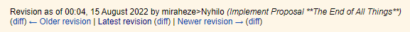
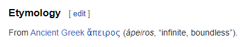

# Apeiros

The rules of this discord bot game is based on a [nomic](https://en.wikipedia.org/wiki/Nomic) game that was played on the [Infinite Nomic Discord server](http://nomic.gay), and was called the "Handwriting Nomic" - officially, Cycle 12. Play of this game began on 6 April 2022 and officially ended on 15 August 2022.

An archive of the final ruleset can hopefully be found [here](https://infinite.nomic.space/wiki/index.php?title=Cycle_12/Ruleset&oldid=2951). A record of the final gamestate of that game can be found [here](https://infinite.nomic.space/wiki/index.php?title=Cycle_12/Gamestate&oldid=2902). Inspecting the edit history of these wikis will be somewhat enlightening as to the history of events that led to the final product.

An additional resource used throughout this game is the [Cycle 12 Map](https://codetriangle.github.io/cycle-12-map/) by my friend [CodeTriangle](https://github.com/CodeTriangle/cycle-12-map), which will be referenced later in this document.

## Introduction and Motivation

The Infinite Nomic discord server is a community where we play this silly rules game called nomic. The details of such a game are out of the scope of this document, but on our 12th "playthrough" of the game, we decided to develop a ruleset centered around the idea of writing the rules of the game down on physical pieces of paper.

The [initial ruleset](https://infinite.nomic.space/wiki/index.php?title=Cycle_12/Ruleset&oldid=2904) took the form of a set of index cards with rules written out on them with colored ink and precise language, and described the very bare bones of a game of nomic - which would allow players to develop the rules of the game over time. Soon, the evolution of the game led its players to forming a tiled map of drawn locations, wildlife with elemental attributes, and lots of lore. The center of this tiled map was a town called [Apeiros](https://en.wiktionary.org/wiki/apeiro-).

The game ended perhaps prematurely. As many of Infinite Nomic's cycles do, its players lacked the time and energy to keep up with the ruleset's increasing complexity. But we *liked* this game, so we wanted to go out with a bang. A rule was added that dictated the end of the game as being some vaguely apocalyptic event. In order to "win" the game, a player would bond with one of the creatures of the world, journey across the map to a particular location, and ascend with them to... [whatever came next](https://infinite.nomic.space/wiki/index.php?title=Cycle_13). Each player that did so wrote messages of various lengths to convey the feeling of their own journey. The result of this was profoundly emotional! And many of us hold Handwriting Nomic dear for the feelings it left behind. I've included a number of screenshots of these messages in `/concept documents/farewells`, for posterity.

Though we couldn't continue the game as it was, and many of us wanted to move on to something new, Handwriting Nomic left an impression on us. It has been something that we wanted to continue. A shared world that deserved to be built on, developed, and lived in.

This discord bot is an effort to help ensure that Apeiros might live forever.

## Approach

Apeiros (the bot, not the town) aims to implement the ruleset as of its [penultimate revision](https://infinite.nomic.space/wiki/index.php?title=Cycle_12/Ruleset&direction=prev&oldid=2951), which holds the spirit of the game in its prime without the concept of it coming to an end. 

In the future, "ascension" may be a feature of game that does not involve the game ending, newer features may be added that were discussed back before Cycle 12 ended but weren't able to be proposed in time, and new features may be added that our community will come up with as Apeiros continues to grow. Let's dive in.

## Game features

Changing the rules of the game is an implicit part of a Nomic. However, this game will have no inherent "rule"-changing features outside of the typical use of pull requests and version control. A such, any reference to "cards" or "sheets" in the original ruleset will be organically replaced with simple image submissions.

## Channels

There will be a minimum of 2 channels involved. One channel will be dedicated to player actions, and is not expected to be coherent. The other channel will not be a gamestate update/archive channel that only the bot can post to. Additional channels may be needed as this plan of action develops.

Shorthand for these channels in this document will be **#actions** and **#gamestate**.

Other channels that may be needed include: **#new-locations**

## Images

All images are encouraged to be submitted as drawings, and will almost always be required to be nearly square in aspect ratio.

- Images that are not hand drawn will be allowed without enforcement initially, but a feature may be added to allow the community to vote out any submissions that do not fit the agreed upon standard of creativity.
- Images will be assessed programmatically as being "square" enough (likely with some kind of margin of error, 5%?) and will be cropped before saving (after asking the player for approval). Images outside this margin will be rejected.

## Players

Any user of a discord server may join as a player, allowing them to post in the #actions channel.
Players are not assumed to be able to leave the game, but may send a command to !reset their player profile if desired.

Players have several attributes associated with them - presented in a "character sheet" form generated by the game - and include:

- A **name** which will initially be their discord name at the time of joining, but may be changed at any time.
- A **token** to represent themself on the map and in other aspects of the game, submitted as a small, square "icon".
- A **medal box** showcasing various achievments the player has obtained. These will be explained in more detail below.
- A number of **Gooderhose** points, a currency in need of a purpose.
- An **inventory** showing what items the player is in possession of.
- The player's **team** of nomsters that that they have tamed, and an indication of whether the player is bonded to one or more of those nomsters.

Possible actions involving this feature may include: `!join` (will prompt for name and icon), `!setname`, `!seticon`, `!showsheet/!charsheet/!sheet/!cs`

## Items

Items are resources that may or may not be able to be stackable with each other (that is, fungible). At the end of the original game, I believe the only items that were available were **treats**, which were given to adopted nomsters. Treats may need to be gained through more complex means than simply wanting one, as in the original ruleset.

Possible actions involving this feature may include: `!trade` (requires acceptance on the account of the target party)

## Medals

In the original ruleset, medals were granted automatically upon completion of some task, such as adding a new location to the map.

Medals are submitted attributes (small, square image), so awarding these programatically might prove difficult. As such, this ruleset offers that medals be awarded by proposal of one citizen of Apeiros, with ascent by another player. This could be done via reactions on the proposal message, or another way.

Commands:
- `!newmedal Cartographer` - Prompts for an image and the requirements for gaining it.
- `!viewmedal Cartographer` - Shows the medal's symbol and the requirements for gaining it.
- `!awardmedal @player Cartographer` - Proposes that the named player is worthy of such a medal.

In the original ruleset, medals also existed in limited quantity. Scarcity gave them value, so the same might be useful here as well.

## Locations

Players may submit new locations to add to the map of the game. In the original ruleset, players could submit location suggestions without limit. The process for submitting a location is as such:

- Player A would submit a square image that was the drawing of an unidentified location
- Player B would reply to an unfulfilled location suggestion with a "tile" that contained all the other required information for a location (name, description, etc.)

Assuming the proposed coordinate for the location was free, this would then cause the location to exist on the map. There was also an expiration time, a suggestion older than 1 week will reject any attempts to fulfill it.

A location "tile" is the abstract entity assuming its location on the map and containing all the info it needs to be a location. Being "at" a location and "on" a tile are the same thing. A location "card" is the set of info representing a location.
A location has the following properties:

- An **image** of the location, preferably hand drawn, of square aspect ratio. 
- A **name**.
- A set of **coordinates** in the x,y plane of the game map.
- A **description** of the location. This description is for theming purposes and doesn't have any other game feature interactions (but is arguably the most important part).
- A possible list of **tags**.
    - The "Populated" tags "Civilized", "Hospitable", "Buildable", and "Farm" indicate that nomsters do not spawn there, and that a settlement might exist there. "Road" may be a potential additional tag.
    - The "Wild" tags "Heat", "Electricity", "Plant", "Air", "Light", "Cold", "Water", "Metal", "Land", and "Dark" indicate the primary types of nomsters that might spawn there.

Only the name, coordinates, and description are for a location to be added to the map. Tags are unveiled during **Surveying**. Though perhaps a state of "Populated" or "Wild" can be enforced.

In addition to commands to investigate the map data as it is (`!map <coords>`), the bot will have an outward-facing api regarding the map. That is, it will be able to make POST requests to an endpoint so that endpoint may render the data. Perhaps the bot simply stores the data to a local sql server and it is the responsibility of the bot owner to implement further interoperability.

## Travel

All players start in the central tile at (0,0), Apeiros. To travel around the map, they can use a movement syntax to traverse the mapped tiles.

`!move up up left up`, `!move up 4, left 2, down`, etc.

Movement through **Wild** tiles may trigger an encounter with a wild **nomster**

## Surveying

A location must be surveyed in order to unveil its tags, to travel through, and before any nomsters can be encountered there.

A location must be traveled to before it can be surveyed. Once traveled into, a player may only survey that tile or return to the tile from whence they came.

In order for a tile to be revealed, it must be surveyed 3 times. A player can use `!survey`, but doing so has a cooldown before they can do it again. Multiple players may contribute to surveying a given tile. When surveying a tile, a player may specify a Type tag for the tile (i.e. `!survey Water`). Once all surveys are complete, a random tag is chosen from the suggested tags and applied to the tile. If no tag is provided, that will be interpreted as a "random" contribution, and may lead to an unexpected tag chosen for the tile at the end of the survey!

In the original ruleset, "populated" tags were possible things to survey, but further development of this game may see that building new populated areas through **terraforming** is desired instead. Another idea might be to increase the difficulty of surveying tiles the farther they are from a **populated** tile.

The `!map` command mentioned in **Locations** would likely include the survey information for an unsurveyed tile, for reference.

## Terraforming

Players can terraform **wild** location tiles to change its tags. 

The original ruleset required that two or more nomsters that share a type with the target tile must be required to do this. And only one on the player's team. I find this to be anti-intuitive, so I will note this game's implementation as such:

A player with 3 of a given type of nomster on their team may begin terraforming a wild tile, changing its type tag to desired type (the type shared by the three nomsters on the team). As with surveying, a number of terraforming actions would need to be performed for this operation to complete, and multiple players can work towards this goal. 3 is a good number. Terraforming may also trigger encounters while the players reside there. Once a terraform is complete, there should be an opportunity to update the location's image.

I.e.: `!terraform water`

Terraforming may also provide the tools to build new settled areas. A settled area could have certain requirements and require different efforts to make them be. Some ideas for this might include:

- **Roads** may be terraformed using the same type as the wild location. Roads could only be built adjacent to tiles that are already **populated**, such as civilizations, farms, and other roads
- **Hospitable** may be a first step terraform to the creation of new settlements. This terraform could require nomsters of a particular type that counteracts or compliments the type of the tile, such as **light** on a **dark** tile, **cold** on a **heat** tile, etc.
- From there, a tile could be branched to be terraformed into a **Farm** using **land**, **water**, and **plant** nomsters (possibly requiring all 3), or a second stage **Buildable** state that requires **land**, **water**, or... **air**? **metal**? This bit needs work.
- Finally a settlement is built to be **Civilized** once it is terraformed using **land**, **metal**, or perhaps **electricity** if modern amenities are decided to be valid in the lore of this game.

Successfully terraforming in any case grants the responsible parties **gooderhose** points for their efforts.

`!terraform road`

## Nomsters

Finally, nomsters.

A typical nomster has the following properties:

- A **portrait**. Square, of course.
- A **type**, selected from the same list as the location types.
- A **class**, "Amphibian", "Arthropoid", "Avian", "Piscine", "Mammalian", or "Reptilian".
- A **species**. Pokemon-esque. This is the generic name for the creature.
- A **description** of the species. As with locations, this is all fluff (and critically important).

A tamed nomster additionally gains the following traits:

- A **name**, given by the player who adopted it. Names should be unique for command simplicity
- An **owner**.

## Encounters

In the original ruleset, a fixed number of nomsters were spawned on the world map each phase of the game. The number that could spawn was a fraction of the number of tiles in existence. New nomsters would spawn with a random type and class and in a random (non-**populated**) tile on the map.

I propose something similar. Given some periodic time (day, week, or some such), the following happens:
- A number of **wild** locations equal to 2/3rds the total number of tiles are selected randomly. A tile may be selected multiple times. On each tile, spawn a nomster of that type with a random **Class**. The species of this nomster is unknown, but it is indicated to the players (possibly in the **#gamestate** channel) where spawns have taken place. 

The spawned nomster has a random chance to be the same species as a nomster that was encountered there or in a nearby tile before. It will be indicated as such, or indicated to be "unknown" if it is a new species.

A player who moves into, out of, or takes certain actions (such as surveying) within a tile that has a spawn begins an encounter with that nomster. At this point, the player may attempt to tame the nomster.

After taming a nomster, players may submit new species info with `!createnomster`. Some limitation should be put into place here to ensure this happens. Perhaps a player cannot perform actions that may trigger a new encounter until they create an unknown nomster on their team.

## Taming and Tamed Nomsters

If an encountered nomster is one that has been spawned before, the player may attempt to try and tame it right then and there. Initially this will be a simple flat 1/3 chance of succeeding, but may include battle mechanics or other technique to affect the odds in the future. Perhaps having certain items or types of nomsters on your team will boost your odds. Perhaps failing to catch one will make it more difficult to catch in the future, reducing the odds to 5% or so, creating a nice "white-whale" story.

If the nomster species is unknown, and the player chooses to try an tame it, the player will have an opportunity to create the new nomster species. The nomster (and other nomsters in the world generated with the same id), will be indicated as unknown until someone tames and creates them. See **Nomsters** above.

Some commands that you can give your nomster (nomsters will also have a numeric id on your **character sheet** to make using these commands easier):
- `!follow <nomster>`, `!stay <nomster>` - Commands to nomsters in the same tile as you to have them move
- `!lick <nomster> @player` - You can command your nomster to interact with another player, giving that player gooderhose points.
- `!treat <nomster>` - Give a treat to a nomster in the same location as you. It does not have to be your nomster (but would need to be specified by name instead of id number if so.)
- `!cuddle <nomster>` - This does have to be your nomster. Don't go cuddling other peoples' nomsters.
- A nomster that has been both given a treat and cuddled on consecutive days is bonded with its player. Initially implementation would dictate that a player can only be bonded with one nomster at a given time.
- `!transfer <nomster> @player` - Transfer your nomster to another player's team. You will still be marked as the nomster's original owner, but that player may give it commands as well. Doing this action requires that you, the nomster, and the receiving player are in the same location, consent from the receiving player, and for the receiving player to have given a treat to the nomster in the last 7 days.

## Consideration - Treats

Trivially, having players buy treats with Gooderhose points would be a perfectly good use for that currency. Tracking how much a given nomster likes you would be trivial motivation for that as well.

## Consideration - Limited actions

In the original ruleset, many actions were limited to "once per phase" use. Surveying, terraforming, attempting to tame a nomster, etc. I believe this could be changed to "once per day" globally with minimal impact. 

In the future, players may find a desire for an economy. Farms make food. Food powers the economy of cities. Economies produce currency. Currency is used to build more populated tiles - roads, new cities, etc.

## Consideration - Stats

One of things I wanted to try and implement were stats for the nomsters. These were personality based, and focused on "rallying the crowd" so to speak rather than beating the crap out of each other.

A new nomster species would have some randomized base stats on creation, and an individual nomster would vary from that baseline somewhat.

In this implementation, a new nomster species would also have a "base catch rate" affected by these stats. The higher the total stats, the exponentially harder it will be to tame.